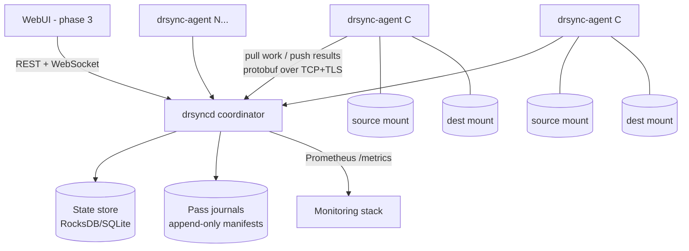

# drsync — Distributed rsync for Multi-Billion File Migrations

**Status:** Phase 1 implemented; parts of phase 2/3 landed ahead of schedule —
large-file chunking (including cross-fleet fan-out), verify/delete passes, and a
the WebUI console all ship today. See §9 for the per-phase status. Key
decisions ratified 2026-07-10 (see §10).
**Date:** 2026-07-10 (status updated 2026-07-17)
**Author:** drafted for review by Steven Rhoods

---

## 1. Problem Statement

Migrate and consolidate extremely large filesets (multi-billion files, PB-scale, high
change rate) between POSIX filesystems presented over **NFS, Weka and GPFS/Spectrum Scale**
mounts, preserving **all** file data and metadata at the destination.

Existing tools fail at this scale:

| Tool | Limitation |
|---|---|
| `rsync` | Single-threaded walk + delta engine; days just to enumerate |
| `msrsync` / `parsyncfp` / `fpsync` | Parallel, but confined to **one host**; bounded by one node's NFS client, CPU and memory |
| mpiFileUtils (`dsync`, `dcp`) | Multi-node, but MPI-coupled: one rank failure kills the job, no incremental restart granularity, no long-running service model, no UI |
| Vendor tools (XCP, AFM, etc.) | Filesystem-specific; we need one tool across NFS/Weka/GPFS in both directions |

**Core requirements**

1. Scale-out: N agents across M hosts, each mounting source and destination.
2. Scan source **and** destination concurrently; compute the difference; copy only what's needed.
3. Full metadata fidelity (owner, group, mode, timestamps, xattrs, ACLs, sparseness, symlinks, device nodes — hardlinks TBD, see open questions).
4. Survive agent/host failure without restarting the migration.
5. Iterative convergence: repeated incremental passes until the delta is small enough for cutover (high change rate on source).
6. Agents in **C** for maximum per-node throughput.
7. Monitorable via a WebUI (later phase — but the telemetry/API surface is designed in now).

---

## 2. Architecture Overview

Classic **control plane / data plane** split. One coordinator (HA-capable later),
many stateless-ish agents. Agents do all filesystem I/O; the coordinator never touches
the data mounts.

```
                                ┌──────────────────────────────┐
                                │           WebUI (later)      │
                                │   React/htmx over REST/WS    │
                                └──────────────┬───────────────┘
                                               │ HTTPS / WebSocket
                              ┌────────────────▼─────────────────┐
                              │         drsyncd (coordinator)    │
                              │ ─ job & pass lifecycle           │
                              │ ─ shard queue + lease manager    │
                              │ ─ agent registry / heartbeats    │
                              │ ─ stats aggregation, REST API    │
                              │ ─ Prometheus /metrics            │
                              └───┬──────────────────────────┬───┘
                                  │                          │
                       ┌──────────▼──────────┐    ┌──────────▼──────────┐
                       │  State store        │    │  Journal / manifest │
                       │  (embedded RocksDB  │    │  (append-only,      │
                       │   or SQLite-WAL)    │    │   per pass)         │
                       └─────────────────────┘    └─────────────────────┘

            binary protocol over TCP/TLS (protobuf-framed), pull-based work
        ┌──────────────────────┬──────────────────────┬──────────────────────┐
        │                      │                      │                      │
┌───────▼────────┐    ┌────────▼───────┐     ┌────────▼───────┐         ┌────▼───┐
│ drsync-agent 1 │    │ drsync-agent 2 │     │ drsync-agent 3 │   ...   │ agent N│
│  (C, one per   │    │                │     │                │         │        │
│   host, thread │    │  scan / diff / │     │                │         │        │
│   pools + io_  │    │  copy / verify │     │                │         │        │
│   uring)       │    │  workers       │     │                │         │        │
└───┬────────┬───┘    └───┬────────┬───┘     └───┬────────┬───┘         └─┬────┬─┘
    │        │            │        │             │        │               │    │
┌───▼───┐ ┌──▼────┐   ┌───▼───┐ ┌──▼────┐    ┌───▼───┐ ┌──▼────┐      ┌──▼─┐ ┌▼───┐
│SOURCE │ │ DEST  │   │SOURCE │ │ DEST  │    │SOURCE │ │ DEST  │      │SRC │ │DEST│
│ mount │ │ mount │   │ mount │ │ mount │    │ mount │ │ mount │      │    │ │    │
└───────┘ └───────┘   └───────┘ └───────┘    └───────┘ └───────┘      └────┘ └────┘
     NFS / Weka / GPFS client mounts on every agent host (same paths everywhere)
```

Same thing as a component diagram:



### 2.1 Components

| Component | Language | Role |
|---|---|---|
| `drsync-agent` | **C** (C11, Linux-only) | All filesystem work: scan, diff, copy, metadata apply, verify. One process per host, internal thread pools + io_uring. |
| `drsyncd` (coordinator) | **Go** (decision D1) | Job orchestration, shard queue, leases, agent registry, stats aggregation, REST/gRPC API, Prometheus metrics. No data-path I/O, so C buys nothing here; Go buys the HTTP/API/concurrency layer nearly for free and halves control-plane risk. |
| `drsync` (CLI) | Go (thin client of the REST API) | Submit/inspect/pause/cancel jobs; `--dry-run`; tail progress in a terminal. |
| WebUI | Single self-contained HTML file, no build step | Dashboard + job/agent/shard control, sits on the same REST/WS API as the CLI. |

**Key principle:** the CLI and the WebUI are both just API clients. Nothing is designed
"for the UI" later — the API and metrics exist from day one.

---

## 3. Work Model

### 3.1 Hierarchy

```
Job        one migration definition: src root, dst root, options, filters
 └─ Pass   one full convergence iteration over the tree (pass 1 = bulk, 2..n = incremental)
     └─ Shard   unit of scheduling = a directory subtree slice (target ~50k–500k entries)
         └─ Task    unit of agent-internal work: stat-diff batch, file copy, chunk copy,
                    metadata apply, verify
```

### 3.2 Sharding the namespace

The fundamental scale problem is enumeration. A billion-file tree cannot be listed by
one walker; and we can't know the shape of the tree up front.

**Dynamic recursive splitting (work discovery = work execution):**

1. Coordinator seeds the queue with the root directory as shard 0.
2. An agent leases a shard and walks it **breadth-limited**: it processes entries in that
   directory (and small subdirectories inline), but any subdirectory that looks large
   (heuristic: > `split_threshold` entries, or depth budget exhausted) is **not descended
   into** — it is pushed back to the coordinator as a *new shard*.
3. Result: the tree self-partitions into hundreds of thousands of independent shards that
   fan out across all agents, with no prior knowledge of tree shape. Hot/huge directories
   (the "100M files in one dir" pathology) get **intra-directory range sharding**: split by
   `readdir` cursor ranges so multiple agents can chew one directory.

This is a work-stealing pattern with the coordinator as the queue; agents *pull* work, so
a slow NFS mount on one host never stalls the fleet.

Because the descend-vs-push-back decision is the agent's, a volume smaller than one
shard's budget would never split — one agent would walk it while the rest idle. The
coordinator therefore overrides the budget while the fleet holds fewer walk shards than it
can run: it tells each granted shard to push every subdirectory straight back until the
queue can cover the fleet, then lets shards descend deeply again. Small volumes fan out
without hand-tuning, and PB-scale behaviour is unchanged once the queue is deep.

### 3.3 Scan + diff are one operation (dual-tree walk)

There is no separate "scan source, scan destination, then compare" phase — at this scale
you cannot afford to materialize two multi-billion-row listings and join them. Instead,
each shard walk opens **both** `src/<relpath>` and `dst/<relpath>` and merge-walks the two
directories (both sorted by name in memory per directory):

- present in src, absent in dst → **create** (copy task)
- present in both, metadata differs → **update** (copy or metadata-only task)
- absent in src, present in dst → recorded in the shard result as an **orphan**
  (report-only by default; acted on only in an explicit, flag-gated delete pass)

**Difference predicate** (per file, cheap → expensive):

1. type (file/dir/symlink/dev) differs → replace
2. size differs → copy
3. mtime differs (ns-precision, with configurable slop for NFS timestamp granularity) → copy
4. uid/gid/mode/xattrs/ACLs differ → metadata-only fix (no data movement)
5. sampled: checksum compare on the verification sample (decision D4) → copy on mismatch

### 3.4 Filesystem-specific scan accelerators (pluggable "lister" backends)

The walk layer is an interface with backends, because the mounts differ wildly:

| Backend | Mechanism | Notes |
|---|---|---|
| `posix` (default) | `openat` + `getdents64` batches + `statx` | Works everywhere; NFS gets READDIRPLUS batching for free via the client |
| `gpfs-policy` | `mmapplypolicy` LIST rules → file lists ingested as pre-computed shards | Scans metadata at millions of files/sec using GPFS's own inode scan; also yields ctime-changed-since-T lists for **incremental passes** |
| `weka-snap` | Snapshot-to-snapshot diff (when available via Weka API) | Turns incremental passes into "changed file list" instead of full re-walk |

Pass 1 always works with `posix` alone; accelerators are optimizations that shrink
incremental pass times from hours to minutes. This pluggability is a first-class design
seam, not an afterthought.

> **Decision D6:** initially GPFS and Weka are treated as plain NFS/POSIX mounts — only
> the `posix` backend is implemented in phases 1–2. The `gpfs-policy` and `weka-snap`
> backends remain roadmap items behind this interface.

### 3.5 Pipeline within a shard

```
lease shard ──> dual-tree walk ──> emit tasks ──────────────┐
                     │                                      │
                     ├─ mkdir skeleton (dirs created        ▼
                     │  eagerly, perms/times deferred)   copy tasks ──> data copy
                     │                                      │        (io_uring /
                     └─ large files split into chunk        │         copy_file_range)
                        tasks (parallel even across         ▼
                        agents, e.g. 10 TB file)        fsync + apply metadata
                                                            │
                                                            ▼
                                              shard result ──> coordinator
                                              (counts, bytes, orphans, errors)
```

- **Directory metadata is applied in a final fix-up sweep per shard** (children first),
  because writing into a directory disturbs its mtime, and restrictive dir modes (e.g.
  0500) must land *after* population.
- **Large-file chunking (implemented):** a file ≥ `chunk_threshold` (default 8 GiB) and
  larger than one `chunk_size` becomes independent chunk-copy tasks (offset/length). The
  coordinator lays out the ranges and grants them **across hosts**, all writing one
  shared destination temp (preallocated with `fallocate`); a final task fsyncs, applies
  metadata, and renames it into place once every range lands. So a single 20 TB file is
  copied by the whole fleet — essential on Weka/GPFS where single-stream throughput is a
  fraction of aggregate. A qualifying file smaller than two chunks (or when only one agent
  is connected) is still copied locally in parallel ranges.

### 3.6 Convergence passes and cutover

High change rate ⇒ one pass is never enough:

- **Pass 1 (bulk):** moves ~all the data. Slow, but subsequent passes are metadata-bound.
- **Pass 2..n (incremental):** re-walk (or accelerator-driven change list), copy the delta.
  Each pass is faster. The coordinator reports **delta size per pass**; when it plateaus
  at the source's change rate, you're converged.
- **Cutover pass:** run under a source write freeze (org process, not drsync's job),
  final delta + optional delete pass + verify. drsync's role is making this window
  *short and predictable* — the per-pass stats give you exactly that.

---

## 4. Metadata Fidelity

The fidelity contract, explicit per attribute (this table becomes a test matrix):

| Attribute | Mechanism | Notes |
|---|---|---|
| mode/uid/gid | `fchownat`/`fchmodat` (no-follow) | chown first, then chmod (setuid bits survive) |
| atime/mtime | `utimensat` ns-precision | applied post-write; dir times in fix-up sweep |
| ctime | **not preservable** on POSIX | documented; verification excludes it |
| symlinks | `readlinkat`/`symlinkat` + `lchown` | never followed |
| xattrs | `listxattr`/`getxattr`/`setxattr` | all namespaces we can read; `security.*` needs CAP_SYS_ADMIN or root |
| POSIX ACLs | via `system.posix_acl_access/default` xattrs | GPFS honors these; verified per-FS-pair |
| NFSv4 ACLs | `system.nfs4_acl` xattr where the client exposes it | **known risk area** — fidelity depends on both mounts; flagged per-file when not translatable |
| sparse files | `SEEK_HOLE`/`SEEK_DATA` on source, `fallocate(PUNCH_HOLE)`/skip on dest | falls back to zero-detection where lseek doesn't support holes (NFS < 4.2) |
| hardlinks | **not preserved** (decision D3) | nlink>1 files copied as independent files; counts and duplicated bytes reported per pass so the cost stays visible |
| device/FIFO/socket nodes | `mknodat` | requires root/CAP_MKNOD |
| Project/quota IDs, immutable flags | `FS_IOC_GETFLAGS`, per-FS | best-effort, reported when unsupported |

Every non-preservable attribute is **counted and reported**, never silently dropped —
the migration report enumerates exactly what fidelity was achieved.

Agents run as **root on the agent hosts** (required for chown, xattr namespaces, and
reading all source files); mounts should use appropriate export options
(`no_root_squash` or equivalent auth on NFS).

---

## 5. Agent Internals (C)

```
drsync-agent
├── control thread      TCP/TLS to coordinator; lease renewal, heartbeat (5s),
│                       task pull, result push (protobuf-framed)
├── walker pool         K threads: getdents64/statx batches, merge-diff, task emit
├── copy pool           L threads driving io_uring rings:
│                       read(src) → write(dst) with registered buffers, or
│                       copy_file_range/server-side copy when src+dst allow it
├── metadata pool       M threads: chown/chmod/utimensat/xattr/ACL apply
└── stats thread        per-second counters → coordinator (files, bytes, IOPS,
                        latency histograms, error classes)
```

- **statx batching:** the walker issues stats via io_uring (`IORING_OP_STATX`) to hide NFS
  round-trip latency — this is *the* difference between 5k and 100k+ stats/sec/host on NFS.
- **Backpressure:** bounded queues between pools; walker stalls rather than OOM. Memory
  budget is a hard config (`--mem-limit`), everything else derives from it.
- **Crash safety:** agents hold no durable state. A dead agent's shard leases expire
  (30 s) and the coordinator re-queues them. Copy tasks are idempotent: re-copy is
  correct because completion (including metadata) is only acknowledged after fsync +
  metadata apply, and interrupted temp state is detected via a per-file in-progress
  marker xattr (or `.drsync.tmp.` name, configurable) on the destination.
- **Dependencies:** deliberately tiny — liburing, a vendored protobuf-c (or hand-rolled
  framing), OpenSSL for TLS + checksums. No glib, no libevent.

---

## 6. Coordinator, State and Fault Tolerance

- **State store:** embedded (RocksDB or SQLite-WAL) on the coordinator host — shard
  states, leases, agent registry, pass statistics. Sized by *shards* (~10⁵–10⁶ rows),
  **not files** (10⁹) — this is what keeps the coordinator small. Per-file information
  lives only in streamed, append-only **journals** (one per pass: what was copied,
  orphans found, errors, fidelity exceptions) — these journals are the audit trail and
  feed the final migration report.
- **Leases:** every shard/task lease has a TTL; agents renew with heartbeats. Expiry ⇒
  re-queue. At-least-once execution + idempotent tasks = correctness.
- **Coordinator restart:** full recovery from the state store; agents reconnect and
  resume (in-flight leases either renew or expire naturally).
- **Coordinator HA:** *phase 2* — active/passive with state on shared storage or litestream-style
  replication. A coordinator outage pauses new work but loses nothing; this is acceptable
  initially.
- **Error taxonomy:** transient (EAGAIN, ESTALE, timeouts) → bounded retry with backoff,
  then park the task; permanent (EACCES, EDQUOT, ENOSPC) → journal + surface in UI.
  ESTALE on NFS gets special handling (re-resolve path from the root).

---

## 7. Observability & WebUI (designed now, built in phase 3)

- **From day 1:** coordinator serves REST (`/api/v1/jobs`, `/passes`, `/shards`, `/agents`,
  `/errors`) + `/metrics` (Prometheus) + WebSocket event stream. Structured JSON logs.
- **Key metrics:** files & bytes scanned/copied/verified per second (per agent + fleet),
  shard queue depth, lease expiries, error rates by class, per-mount latency histograms,
  pass delta trajectory (the "are we converging?" curve), ETA model.
- **WebUI (phase 3):** job dashboard (progress, throughput, convergence curve), agent
  fleet view, error browser drilling into journals, pass comparison, cutover-readiness
  panel. Until then, Grafana over `/metrics` plus the CLI covers monitoring.

---

## 8. Security

- mTLS between agents and coordinator (per-agent certs, simple internal CA bootstrapped
  by `drsync ca init`).
- REST API / WebUI: bearer token (read from a mode-0600 file, `-api-token-file`,
  never a raw CLI value — drsyncd refuses to start on a group/world-readable
  token file), and/or interactive login (local host accounts via `/etc/shadow`,
  or Active Directory via LDAP bind) gated by a username/group allowlist,
  backed by a signed session cookie (`/etc/drsync/auth.yaml`). The listener
  itself is plain HTTP by default and switches to HTTPS when a cert/key pair
  is configured (`/etc/drsync/certs.yaml`). OIDC/SSO remains a possible future
  addition.
- Agents run as root but **only** touch configured src/dst roots (paths validated,
  `openat`-anchored — no path traversal outside the roots even via hostile symlinks:
  all traversal uses `O_NOFOLLOW` + fd-relative ops).
- Dry-run mode and a default **no-delete** posture; destructive actions (delete pass)
  require an explicit flag *and* job-level confirmation.

---

## 9. Repository Layout & Phasing

```
drsync/
├── agent/          C: the data-plane agent
├── coordinator/    Go: drsyncd
├── cli/            Go: drsync CLI
├── proto/          protobuf definitions (wire protocol + REST models)
├── webui/          phase 3
├── docs/           this file, runbooks, fidelity matrix
└── test/           fidelity matrix tests, fault-injection harness, scale rigs
```

| Phase | Deliverable | Status |
|---|---|---|
| **1 — MVP** | Coordinator + agent, posix lister, dual-tree diff, copy + full metadata, passes, CLI, Prometheus metrics. Correctness proven by fidelity test matrix. | **Shipped.** Plus mTLS, entry-list sharding for pathological directories, and coordinator-driven fleet spread so a volume below `shard_budget` still fans out across every agent (`test/fanout_e2e.sh`). |
| **2 — Scale & resilience** | Large-file chunking, GPFS policy lister, verify pass, delete pass, coordinator HA, fault-injection test suite, 1B-file synthetic benchmark. | **Partial.** Shipped: large-file chunking — local parallel ranges **and** cross-fleet chunk fan-out with idempotent recovery (`test/chunk_e2e.sh`, `test/chunk_resilience_e2e.sh`); verify pass (sampled xxHash3); delete pass. Outstanding: GPFS policy lister, coordinator HA, fault-injection suite, 1B-file benchmark. |
| **3 — WebUI & polish** | WebUI, Weka snapshot lister, reports, cutover tooling. | **Partial.** Shipped: WebUI console (monitoring, job/agent/parked-shard control, error browser), per-pass reports, login (local accounts / Active Directory) + logout, optional HTTPS for the REST/WebUI listener, email notifications (per-pass, end-of-job summary with a per-pass duration column, tick-driven parked-shard alert digest). Outstanding: Weka snapshot lister, cutover tooling. |

---

## 10. Decisions (D1–D9 ratified 2026-07-10; D10 2026-07-19)

| # | Decision | Choice | Consequence |
|---|---|---|---|
| **D1** | Control-plane language | **Go** for `drsyncd` + CLI; **C** for 100% of the data path | Mixed-language repo; protobuf definitions in `proto/` are the single contract between the two |
| **D2** | Mount topology | **Every agent host mounts both src and dst** | Agents copy locally; no file data ever crosses the drsync control network. No relay tier needed |
| **D3** | Hardlinks | **Not preserved** — nlink>1 files copied as independent files | No global inode map required. Agents count nlink>1 files and duplicated bytes per pass; the migration report makes the space cost explicit |
| **D4** | Verification | **Metadata on everything + sampled full checksums** (xxHash3, default 1%, configurable per job) | Verify tasks are a task type like any other; sample selection is deterministic (hash of relpath) so re-runs verify the same set |
| **D5** | Deletes | **Report-only by default**; orphan removal only via explicit flag-gated delete pass (typically at cutover) | Journals always record orphans, so a delete pass needs no extra scan |
| **D6** | Filesystem treatment | **GPFS and Weka treated as plain NFS/POSIX mounts initially** | Only the `posix` lister ships in phases 1–2; the GPFS policy-engine and Weka snapshot listers stay on the roadmap behind the existing lister interface |
| **D7** | Fleet sizing | **4 agent hosts, 100 GbE each; dedicated coordinator host**; source FS delivers 10 Gbps–100s of Gbps | Defaults tuned for this shape (see DESIGN-agent §2). Fleet data ceiling ≈ 50 GB/s (full-duplex copy ≈ 12.5 GB/s/host); in practice source-limited. Scan target ≥ 100k stat/s/host ⇒ 1B entries dual-walked in ≈ 45 min |
| **D8** | NFSv4 | **NFSv4 (incl. v4 ACLs) supported from the outset** — destination estate is moving to NFSv4 | ACL engine handles POSIX ACLs and NFSv4 ACLs (`system.nfs4_acl`) with per-job policy for untranslatable pairs; `copy_file_range` server-side copy used opportunistically on v4.2 |
| **D9** | Job definition | **YAML job specs**, CLI flags as an alternative/override | YAML parsing lives only in the Go control plane; agents receive fully-resolved options as protobuf (no YAML in C) |
| **D10** | Orphan detection in a split directory | **Stays with the splitting shard** — destination enumeration is *not* fanned out as its own shard kind | A pathological directory's source names stream out as entry-list shards while the destination listing is marked in place, so orphans cost one sorted listing and no extra syscalls. The rejected alternative — a destination-slice shard testing each name for source existence — costs one statx per destination entry per pass, and since the destination is built by drsync, pass 2+ would pay ~N statx to find ~0 orphans. The variant that avoids that (a shard re-reading both sides) only relocates the work: same total, same peak memory, plus a new shard kind across proto/agent/coordinator and orphan detection — which seeds the delete pass — moved onto a new code path |

## 11. Detailed Design Documents

| Doc | Scope |
|---|---|
| [docs/DESIGN-protocol.md](docs/DESIGN-protocol.md) | Wire protocol: framing, protobuf messages, connection lifecycle, versioning |
| [docs/DESIGN-coordinator.md](docs/DESIGN-coordinator.md) | `drsyncd`: state machines, SQLite schema, scheduler & leases, journals, REST/WS API, metrics |
| [docs/DESIGN-agent.md](docs/DESIGN-agent.md) | C agent: thread pools, dual-tree walker, io_uring copy engine, metadata/ACL engine, verification, error handling, memory model |
| [docs/DESIGN-jobspec.md](docs/DESIGN-jobspec.md) | YAML job spec schema, CLI mapping, defaults |
```
